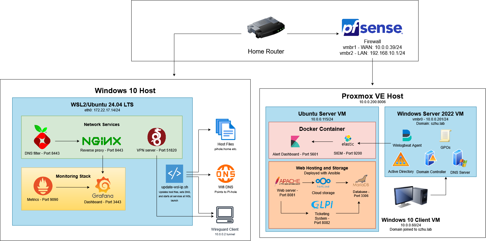

# Computer Networking & Enterprise Security Project
## Author: Shengwei Zhu

*Please refer to the changelog in CHANGELOG.md for the latest updates.*

## Projects
### WSL2 Infrastructure
A self-hosted stack running on Windows Subsystem for Linux (WSL2) featuring DNS filtering, reverse proxying, monitoring, cloud storage, and a VPN tunnel. 

#### Tools and Techologies
- Windows 10/11 with WSL2 enabled
- WSL installed on your Windows system
- Ubuntu 24.04 LTS or similar installed (I installed mine from the Microsoft Store)
- Personal network since router access is required for DNS

#### Stack
| Service | Purpose | URL |
|---|---|---|
| Pi-hole | DNS filtering & ad blocking | `https://pihole.home:8443/admin` |
| Nginx | Reverse proxy | `https://pihole.home:8443` |
| Prometheus | Metrics collection | `localhost:9090` |
| Grafana | Monitoring dashboard | `https://grafana.home:3443` |
| Nextcloud | Personal cloud storage | `http://nextcloud.home:8081` |
| Wireguard | VPN server | Port 51820 |

#### Automation
A boot script (`scripts/update-wsl-ip.sh`) runs on every WSL launch and:
- Updates the Windows hosts file with the current WSL IP
- Sets Windows DNS to point to Pi-hole
- Starts all services automatically
---
### Enterprise Virtualization
A dedicated Proxmox virtual environment running on a Beelink Mini S13 mini PC acting as a physical server, hosting a corporate enterprise environment featuring various virtual machines(VM) used to host Windows Server 2022, Windows 10 Pro, and Ubuntu Linux. 
- The Windows Server 2022 VM acts as Domain Controller(DC) with Active Directory(AD) configured.
- The Windows 10 Pro VM acts as workstation joined to the AD domain.
- The Ubuntu Linux VM acts as an internal server that hosts services including Apache2, MarieDB, Nextcloud, GLPI, and Elastic.
- The Router VM has pfSense installed, which will host the open source firewall.
- Winlogbeat installed on the DC VM and is used to centralize ingested logs from Elastic.
- Nextcloud is installed mainly for personal storage.
- The Kibana dashboard will be used for alert monitoring and log review.
- GLPI will be the ticketing system managed by IT/tech support.

#### Tools and Technologies
- Beelink Mini S13 (Intel N150, 16GB RAM, 500GB NVMe)
- Proxmox VE 8.4 or higher
- Windows Server 2022 Datacenter evaluation ISO
- Ubuntu Server 24.04 LTS ISO
- Cat6 ethernet connection to router

#### Stack
| Service | Purpose | Host |
|---|---|---|
| Windows Server 2022 | Domain Controller | VM - 10.0.0.201 |
| Active Directory DS | User/group/OU management | Windows Server VM |
| DNS Server | Domain name resolution | Windows Server VM |
| GPOs | Security policy enforcement | Windows Server VM |
| Winlogbeat | Log shipping agent | Windows Server VM |
| Windows 10 | Domain-joined client | VM - 10.0.0.60 |
| Elasticsearch | SIEM log storage | Ubuntu VM w/ Docker compose |
| Kibana | Dashboards & alerting | Ubuntu VM w/ Docker compose |
| Nextcloud | Personal cloud storage | Ubuntu VM - :8081 |
| MariaDB | Nextcloud database | Ubuntu VM - :3306 |
| Apache2 | Web server for Nextcloud | Ubuntu VM - :8081 |
| GLPI | IT Service Management | Ubuntu VM - :8082 |
| pfSense | Firewall | Router VM |

#### Active Directory Structure
- 7 Organizational Units: Executive, IT, HR, Finance, Marketing, Operations, Sales
- 26 users provisioned via PowerShell automation
- Security groups per department
- See `proxmox-lab/scripts/` for scripts

#### GPO Security Hardening
- Disabled SMBv1 (EternalBlue/WannaCry mitigation)
- Prevented LAN Manager hash storage (pass-the-hash mitigation)
- Disabled guest account
- Blocked Control Panel access
- Denied removable media access
- Disabled anonymous SID enumeration
- Advanced security auditing enabled
- Windows Firewall enforced
- Prohibited user software installs
- Prevented command prompt access

#### SIEM Pipeline
Windows Security Event Logs
→ Winlogbeat (log shipper)
→ Elasticsearch (Docker, lean mode)
→ Kibana (dashboards + alerting)
→ Custom rule: Event ID 4625 brute force detection

#### Automation
Active Directory provisioning automated via PowerShell scripts:
- `proxmox-lab/scripts/create-ou.ps1` - OU structure
- `proxmox-lab/scripts/create-users.ps1` - user accounts
- `proxmox-lab/scripts/create-groups.ps1` - security groups and membership
- `proxmox-lab/scripts/add-users2groups.ps1` - Adds users to the specific groups
---
## Architecture

### Note
- Replace all placeholder values in configs before use
- Database credentials should be changed from defaults
- Private keys are excluded via `.gitignore`
- Windows Server evaluation ISO and activation key are downloaded and retreived from Azure Dev Tools through Oregon State University

## Resouces
- [Pi-hole Documentation](https://github.com/pi-hole/docs)
- [Nginx Beginner's Guide](https://nginx.org/en/docs/beginners_guide.html)
- [Grafana + Prometheus Getting Started](https://grafana.com/docs/grafana/latest/fundamentals/getting-started/first-dashboards/get-started-grafana-prometheus/)
- [Wireguard Quick Start](https://www.wireguard.com/quickstart/)
- [Nextcloud User Manual](https://docs.nextcloud.com/server/stable/user_manual/en/)
- [Proxmox VE Documentation](https://pve.proxmox.com/wiki/Main_Page)
- [Active Directory DS Installation](https://learn.microsoft.com/en-us/windows-server/identity/ad-ds/deploy/install-active-directory-domain-services)
- [Elastic/Kibana Documentation](https://www.elastic.co/guide/index.html)
- [Winlogbeat Reference](https://www.elastic.co/guide/en/beats/winlogbeat/current/index.html)
- [CIS Benchmarks](https://www.cisecurity.org/cis-benchmarks)
